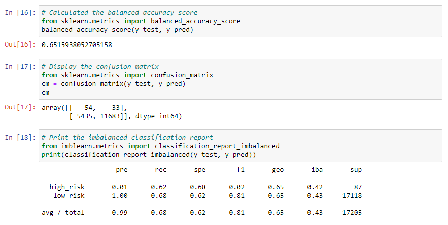
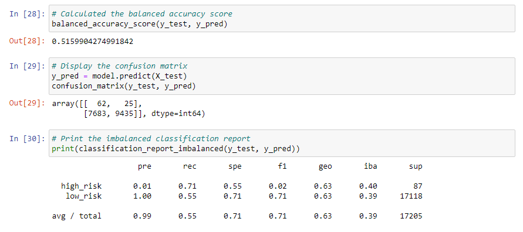

# Credit Risk Analysis
Build and evaluate several machine learning algorithms to predict credit risk using Python.   
To predict credit risk we adopted the following procedure:   

- Oversample the data using the **RandomOverSampler** and **SMOTE** algorithms.
- Undersample the data using the **ClusterCentroids** algorithm.
- Use a combinatorial approach of over- and undersampling using the **SMOTEENN** algorithm.
- Compare two machine learning models that reduce bias, **BalancedRandomForestClassifier** and **EasyEnsembleClassifier**.

We will evaluate the performance of these models and make a recommendation on whether they should be used to predict credit risk.

### Resources
- Data :&nbsp; [LoanStats_2019Q1.csv]()
- Software :&nbsp; [Python](https://www.python.org/downloads/),&nbsp; [Jupyter Notebook](https://www.anaconda.com/products/distribution)

## RandomOverSampler model

## SMOTE model

## ClusterCentroids model

## SMOTEENN model

## EasyEnsembleClassifier model

## BalancedRandomForestClassifier model

