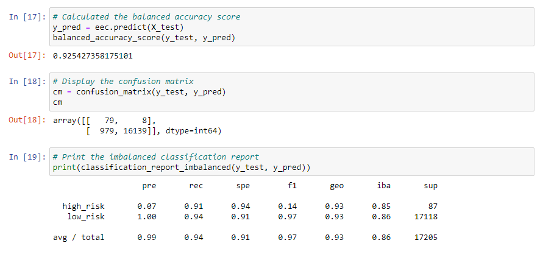

# Credit Risk Analysis
Build and evaluate several machine learning algorithms to predict credit risk using Python.   
To predict credit risk we adopted the following procedure:   

- Oversample the data using the **RandomOverSampler** and **SMOTE** algorithms.
- Undersample the data using the **ClusterCentroids** algorithm.
- Use a combinatorial approach of over- and undersampling using the **SMOTEENN** algorithm.
- Compare two machine learning models that reduce bias, **BalancedRandomForestClassifier** and **EasyEnsembleClassifier**.

We will evaluate the performance of these models and make a recommendation on whether they should be used to predict credit risk.

### Resources
- Data :&nbsp; [LoanStats_2019Q1.csv](https://drive.google.com/file/d/16AEhrStndfbLWY55DunnV-BdZXBaCuNI/view?usp=sharing)
- Software :&nbsp; [Python](https://www.python.org/downloads/),&nbsp; [Jupyter Notebook](https://www.anaconda.com/products/distribution)

## RandomOverSampler model

 
The balanced accuracy score is 65%.  
The high_risk precision is about 1% only with 62% sensitivity which makes a F1 of 2% only.  
Due to the high number of the low_risk population, its precision is almost 100% with a sensitivity of 68%.

## SMOTE model

 
The results are pretty similar to the previous model.  
The balanced accuracy score is 62%.  
The high_risk precision is about 1% only with 63% sensitivity which makes a F1 of 2% only.  
Due to the high number of the low_risk population, its precision is almost 100% with a sensitivity of 66%.

## ClusterCentroids model

 
Here the balanced accuracy score is down to about 52%.  
The high_risk precision is still 1% only with 60% sensitivity which makes a F1 of 1%.  
Due to the high number of false positives, the low_risk sensitivity is only 44%.

## SMOTEENN model

 
The balanced accuracy score is about 52%.  
The high_risk precision is still 1% only with 71% sensitivity which makes a F1 of only 2%.  
Due to the high number of false positives, the low_risk sensitivity is 55%.

## BalancedRandomForestClassifier model

 
The balanced accuracy score improved to about 79%.
The high_risk precision is still low at 4% only with 67% sensitivity which makes a F1 of only 7%.
Due to a lower number of false positives, the low_risk sensitivity is now 91% with 100% presicion.

## EasyEnsembleClassifier model

 
The balanced accuracy score is high to about 93%.
The high_risk precision is still low at 7% only with 91% sensitivity which makes a F1 of only 14%.
Due to a lower number of false positives, the low_risk sensitivity is now 94% with 100% presicion.

 
